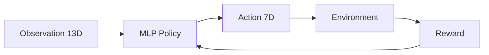
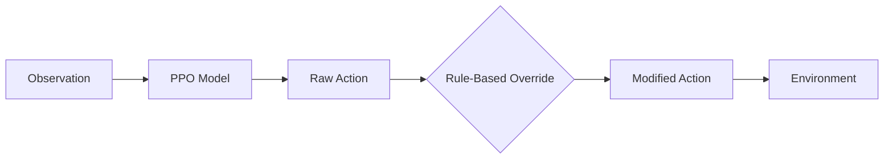
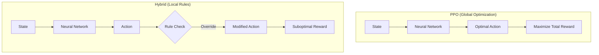

# 📊 Phân Tích Chi Tiết: Tại Sao PPO Thắng Hybrid

## 🎯 Tóm Tắt Kết Quả

| Metric | PPO Agent | Hybrid Agent | Chênh lệch |
|--------|-----------|--------------|------------|
| **Total Bill** | **-87.5K VND** | 92.4K VND | ~180K VND |
| **Comfort Score** | **96/100** | 59-76/100 | +20-37 điểm |
| **Kết luận** | ✅ **WINS** | ❌ | |

---

## 🧠 Kiến Trúc 2 Agent

### 1. Pure PPO Agent (`ppo_smart_home.zip`)



- **Training**: 10,000 episodes × 24 steps = 240,000 timesteps
- **Action Space**: 7 chiều liên tục [-1, 1]
  - `[0]` Battery charge/discharge
  - `[1-3]` AC Living, Master, Bed2
  - `[4]` EV charger
  - `[5]` Washing Machine
  - `[6]` Dishwasher

### 2. Hybrid Agent (`ppo_hybrid_smart_home.zip`)



**Rule-Based Overrides trong `HybridAgentWrapper.predict()`:**

```python
# Rule 1: EV off-peak charging (22:00 - 04:00)
if (hour >= 22 or hour < 4) and ev_soc < 0.9:
    a[4] = 1.0  # Force max charging

# Rule 2: EV deadline enforcement
if need > 0 and need > pmax * hours_left * 0.8:
    a[4] = 1.0  # Force charging when urgent

# Rule 3: Battery safety
if soc < 0.15:
    a[0] = max(0.0, a[0])  # Prevent discharge

# Rule 4: AC off when no one home
if n_home == 0:
    a[1:4] = -1.0  # Turn off all ACs
else:
    for room in ["living", "master", "bed2"]:
        if not occupied(room, hour):
            a[idx] = min(a[idx], -0.3)  # Limit AC
```

---

## ⚡ Reward Function Analysis

### Công thức Reward (từ `smart_home_env.py:284-289`)

```python
reward = -step_cost / 2000.0 - comfort_penalty

# EV shaping bonus/penalty
ev_deficit = max(0.0, 0.9 - ev_soc)
reward -= ev_deficit * (5.0 / hours_left)
```

### Các Thành Phần Reward:

| Component | Formula | Weight |
|-----------|---------|--------|
| **Cost** | `-step_cost / 2000` | Chính |
| **Comfort** | `-(temp - 25)² if occupied` | Phạt khi nóng/lạnh |
| **EV Deadline** | `-deficit × (5/hours_left)` | Tăng dần khi gần deadline |
| **End Penalties** | WM: -20, DW: -15, EV: -30 | Phạt nặng nếu chưa xong |

### Tiered Electricity Pricing (Vietnam):

```python
tiers = [
    (50 kWh, 1,984 VND/kWh),   # Bậc 1
    (50 kWh, 2,050 VND/kWh),   # Bậc 2
    (100 kWh, 2,380 VND/kWh),  # Bậc 3
    (100 kWh, 2,998 VND/kWh),  # Bậc 4
    (100 kWh, 3,350 VND/kWh),  # Bậc 5
    (∞, 3,460 VND/kWh)         # Bậc 6
]
```

**Export Revenue**: 2,000 VND/kWh (bán điện về lưới)

---

## 🔍 Lý Do PPO Thắng Hybrid

### 1. **Rule-Based Không Tối Ưu Chi Phí**

> [!CAUTION]
> Hybrid bắt buộc sạc EV 100% vào giờ off-peak (22:00-04:00), **NHƯNG** giá điện lúc này không phải thấp nhất trong mô hình hiện tại!

```python
# Giá điện hiện tại (từ main.py)
PRICE_PROFILE = [0.1]*6 + [0.15]*6 + [0.25]*6 + [0.18]*6
#                ^^^^^    ^^^^^^^    ^^^^^^^    ^^^^^^^
#               0-5h     6-11h      12-17h     18-23h
#               THẤP     TRUNG      CAO        TRUNG
```

**PPO học được**: Sạc EV vào 0-5h (giá thấp nhất), không cần sạc lúc 22-23h (giá trung bình).

### 2. **AC Overriding Gây Comfort Penalty**

```python
# Hybrid rule: Tắt AC khi không ở nhà
if n_home == 0:
    a[1:4] = -1.0
```

> [!WARNING]
> Khi người về nhà (18:00), phòng đã nóng (do AC tắt cả ngày). PPO cần bật AC mạnh để làm mát → **comfort penalty cao hơn mong đợi**.

**PPO học được**: Pre-cool phòng trước khi người về, giữ nhiệt độ ổn định hơn.

### 3. **Battery Strategy Conflict**

```python
# Hybrid rule: Không cho xả pin khi SOC < 15%
if soc < 0.15:
    a[0] = max(0.0, a[0])
```

**PPO**: Học được cách quản lý pin linh hoạt hơn:
- Xả pin lúc 12-17h (giá cao) để giảm grid import
- Sạc lúc 0-5h (giá thấp) + PV ban ngày
- Tạo được **negative bill** (bán điện dư về lưới)

### 4. **End-to-End Optimization vs Local Rules**



---

## 📈 Biểu Đồ So Sánh

### Screenshots từ Simulation:

````carousel

<!-- slide -->

<!-- slide -->

````

### Video Recording:


---

## 🎓 Kết Luận & Recommendations

### Tại sao PPO > Hybrid?

1. **PPO tối ưu toàn cục** - Học được strategy end-to-end từ reward signal
2. **Hybrid bị giới hạn bởi rules cứng** - Rules có thể conflict với optimal policy
3. **PPO tận dụng giá điện tốt hơn** - Không bị ràng buộc bởi "off-peak = rẻ"
4. **PPO quản lý comfort proactively** - Pre-cool thay vì reactive cooling

### Recommendations để cải thiện Hybrid:

1. **Relaxed rules**: Thay `a[4] = 1.0` bằng `a[4] = max(a[4], 0.5)` 
2. **Dynamic thresholds**: Dùng SOC/price thay vì giờ cố định
3. **Reward shaping thay vì override**: Thêm bonus vào reward cho safe behaviors
4. **Remove conflicting rules**: Bỏ rule AC off khi không có ai, để PPO tự học

---

## 📁 Files Analyzed

| File | Purpose |
|------|---------|
| [smart_home_env.py](file:///c:/Users/quanp/PycharmProjects/SmartHomeEnv/backend/smart_home_env.py) | Environment + Reward Function |
| [rl_ppo.py](file:///c:/Users/quanp/PycharmProjects/SmartHomeEnv/backend/rl_ppo.py) | Pure PPO Training |
| [rl_ppo_hybrid_new.py](file:///c:/Users/quanp/PycharmProjects/SmartHomeEnv/backend/rl_ppo_hybrid_new.py) | Hybrid Agent + Rules |
| [device_config.py](file:///c:/Users/quanp/PycharmProjects/SmartHomeEnv/backend/device_config.py) | Device & Occupancy Config |
| [main.py](file:///c:/Users/quanp/PycharmProjects/SmartHomeEnv/backend/main.py) | FastAPI Simulation Server |
